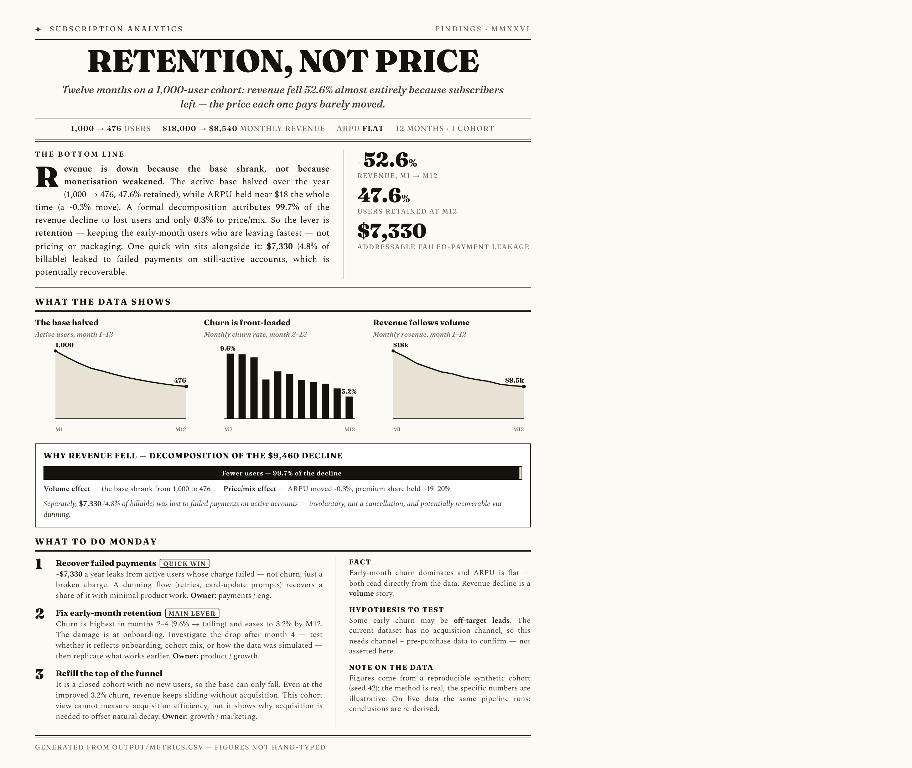
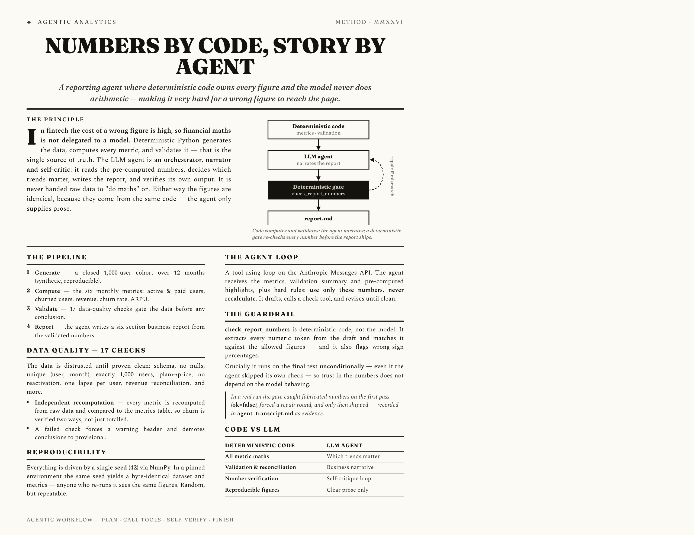

# Churn & Revenue Reporting Agent

A small AI/reporting agent for a consumer fintech subscription business. It
generates synthetic data for a 1,000-user cohort over 12 months, computes the
core subscription metrics, validates them, and produces a short business report.

> **The same result, two audiences** — a business brief and a technical brief,
> both generated from `output/metrics.csv` so the figures can't drift from the report.

**Business brief** — [`findings.en.pdf`](docs/onepagers/findings.en.pdf)



**Technical brief** — [`method.en.pdf`](docs/onepagers/method.en.pdf)



*Russian versions (`findings.ru.pdf`, `method.ru.pdf`) are in [`docs/onepagers/`](docs/onepagers/).*

**Design principle:** the *numbers* are computed by deterministic code (the single
source of truth); the *LLM agent* orchestrates the workflow, narrates the report,
and self-checks — it never does arithmetic. In a fintech context the cost of a
wrong figure is high, so financial calculations are not delegated to a model.

---

## How to run

```bash
python3 -m venv .venv && source .venv/bin/activate
pip install -r requirements.txt

# Full pipeline: generate -> metrics -> validate -> report
python -m src.run_all            # optional: --seed 42

# Tests (metric edge cases, validation, report guardrail)
pytest -q
```

Outputs (regenerated on every run):

| File | Content |
|---|---|
| `data/subscriptions.csv` | synthetic raw data |
| `output/metrics.csv` | the 6 monthly metrics |
| `output/validation.json` | data-quality check results |
| `output/report.md` | final business report (6 sections) |
| `output/agent_transcript.md` | agent loop trace (only when the LLM path runs) |

**No API key required.** Without `ANTHROPIC_API_KEY` the report is produced by a
deterministic template from the same metrics. To run the agentic path instead, put
your key in a local `.env` (copy `.env.example` -> `.env`, add
`ANTHROPIC_API_KEY=...`); `run_all` loads it automatically (the file is gitignored).
The LLM then writes and self-checks the report, and `output/agent_transcript.md`
records the tool-call loop as evidence. Either path uses the same computed numbers.

---

## Data model

A closed cohort: 1,000 users are acquired in month 1 and followed for 12 months;
no new users are added. Each user has a fixed plan and either keeps paying or
lapses (churn). One row per active subscription-month, plus a single
`is_active=False` row in the month a user lapses (a failed renewal that ends the
subscription).

Columns: `user_id, month, plan, monthly_price, payment_status, amount_paid, is_active`.

- Plans: `basic` $10 / `plus` $20 / `premium` $40 (onboarding mix 50/30/20%).
- `payment_status ∈ {paid, failed}`. A `failed` payment on an **active** month
  means the charge failed but the user stays (and may recover) — this is distinct
  from churn (`is_active=False`).
- Churn hazard is front-loaded (higher in the first months, lower later); a failed
  payment raises the churn hazard (involuntary churn).

## Metric definitions

For each month `m`:

| Metric | Definition |
|---|---|
| `active_users` | users with `is_active=True` in `m` |
| `paid_users` | users with `payment_status='paid'` in `m` (subset of active) |
| `churned_users` | users active in `m-1` but lapsed in `m`; **0 for `m=1`** |
| `monthly_revenue` | Σ `amount_paid` in `m` (successful payments only) |
| `churn_rate` | `churned_users[m] / active_users[m-1]`; **0 for `m=1`** |
| `arpu` | `monthly_revenue[m] / active_users[m]` |

**Interpretation choices (fixed to avoid ambiguity):**
- Month 1 churn is **0** by definition — the cohort has no prior period.
- `churn_rate` is **user** churn (denominator = base at start of period), not
  revenue churn.
- `arpu` is per **active** user (not per paying user), so it reflects the realised
  revenue per subscriber including failed payments.

## Data quality checks (`output/validation.json`)

Schema & types · no nulls · unique `(user_id, month)` · exactly 1,000 users ·
month range · plan↔price mapping · payment-amount consistency · lapse-row
consistency · active base non-increasing · `paid ≤ active` · `churn_rate ∈ [0,1]` ·
`payment_status` domain · **no reactivation (churned users don't return)** ·
**at most one lapse per user** · **revenue reconciliation (CSV total == metrics
total)** · ARPU recomputation · **full monthly metric recomputation from raw vs
`metrics.csv` (proves the whole table is correct, not just totals)**.

If any check fails, the report opens with a warning and conclusions are flagged as
provisional.

---

## Agentic approach

**Role of the agent.** Orchestrator + narrator + self-critic — *not* a calculator.
It reads the pre-computed metrics and validation status, decides which trends
matter, writes the 6-section report, and verifies its own output before finalising.

**How the agent is built.** A tool-using loop (Anthropic Messages API):
1. The agent receives the metrics table, validation summary, and pre-computed
   highlights, plus strict rules ("use only these numbers, never recalculate").
2. It drafts the report and calls the `check_report_numbers` tool.
3. The tool (deterministic Python) extracts every numeric token from the draft and
   checks it against the allowed figures from `metrics.csv`, returning any
   mismatches.
4. The agent revises until the check is clean (max 2 rounds), then outputs the
   report.

**Where plain code is used (not the LLM).** All data generation, all metric math,
all validation, and the number-verification tool. The LLM only produces prose.

**Prompts.** A system prompt fixing the analyst role, the hard "no recalculation /
ground every number" rules, and the required 6-section structure; a user prompt
carrying the metrics, highlights, and validation status. See `src/prompts.py`.

**Guardrails.**
- The agent is given only the final metrics + validation, never raw data to "do
  math" on.
- Two layers of number verification: the LLM self-check loop and the deterministic
  `check_report_numbers` (which also flags wrong-sign percentages). The
  deterministic check **always runs on the final report** — even if the model never
  called the tool — and a failure forces a repair round or the template fallback,
  so unverified numbers cannot reach the output.
- Failed data-quality checks force a warning header and demote conclusions.
- Deterministic template fallback guarantees a valid report with zero API access.

**Why this approach.** It maximises what each side is good at: code for exact,
reproducible numbers; the LLM for clear business narrative. It keeps financial
correctness non-negotiable while still being a genuine agentic workflow
(plan → call tools → self-verify → finish).

---

## Stakeholder one-pagers

`docs/onepagers/` holds two newspaper-style one-page briefs that present the same
result to two audiences — and they are **generated from `output/metrics.csv`**,
so the figures in them cannot drift from the report (numbers are not hand-typed):

- `findings.{en,ru}.pdf` — **business** brief: the retention-not-price finding,
  charts, the revenue-decline decomposition, and three prioritised actions.
- `method.{en,ru}.pdf` — **technical** brief: the code-owns-the-numbers
  architecture, the deterministic guardrail, validation, and reproducibility.

Rebuild: `python docs/onepagers/build.py` (renders the EN+RU PDFs via Playwright
Chromium — `pip install playwright && playwright install chromium`).

## Reproducibility

Everything is driven by a single `SEED` (default 42) via
`numpy.random.default_rng`. The same seed yields a byte-identical CSV and metrics
(verified). The LLM narrative may vary in wording but not in figures — those come
from the deterministic core. All knobs live in `src/config.py`.

## Project layout

```
src/
  config.py          # seed, plans, hazards, paths, model
  generate_data.py   # synthetic cohort -> data/subscriptions.csv
  metrics.py         # the 6 monthly metrics -> output/metrics.csv
  validate.py        # data-quality checks -> output/validation.json
  prompts.py         # agent prompts
  agent_report.py    # agentic report (tool-use + self-check) + template fallback
  run_all.py         # pipeline entry point
```

## What I'd add with more time

Multiple churn scenarios (soft/hard) for comparison; payment-retry/dunning
modelling; cohort-style retention curves; a quantitative revenue-loss
decomposition (volume vs failed payments vs plan mix); optional DuckDB/SQL
implementation of the metric layer to mirror a warehouse setup.
